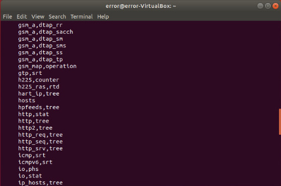
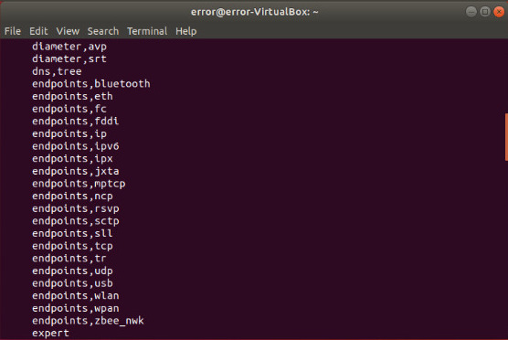

# TSHARK CHEATSHEET


### Basic


**To see all interfaces:**

```bash
tshark -D  to see all interfaces

```

**Capture packets in any mode**
```
tshark -i  any

```

**Capture packets in specific mode**

```bash
tshark -i interface_name/ID number

```


### WRITING AND EXPORTING DATA

**To see some packets after capture**

```bash
tshark -i interface_name

```

**To **save**  packets in a file -w** :
```bash
tshark -i interface_name -w file_name.pcap

```
**To set a count to capture packets :**

```bash
tshark -i interface_name -c 20 -w file_name.pcap

```

**To view the saved file:**

```bash
tshark -r filter_name.pcap | less
```

**To see the details of any specific packets:**

```bash
tshark -r file_name.pcap -c 1 -V

```
**Options to **export** packets:**

```bash
tshark -T x

```

**You can use any options by using the commands**

```bash
tshark -r filter_name.pcap -T  option_name

```
> example:
```bash
tshark -r test.pcap -T  psml | less

```

**To save the listed data in a file:**

```bash
tshark -r test.pcap -T  psml > test.psml

```

### CAPTURE AN DISPLAY Filters

**To use any specific capture filter**

```bash
tshark -i interface_name -f "filter_name" -w filter_name.pcap

```
> example:

```bash
tshark -i interface_name -f "tcp port 80" -w tcp.pcap

```

### Display filters

**Display filters works on already captured packets.**

```bash
tshark -r file_name.pcap  -Y ' filter expression '

```
> example:

```bash
tshark -r tcp.pcap  -Y 'http.request.method == "GET" '

```

### Converting Packets to HTML


> save packets

```bash
tshark -i interface_name -w file_name.pcap

```
> output  the saved file in pdml

```bash
tshark -r file_name.pcap -T  pdml | less

```

> Save it xml formate

```bash
tshark -r file_name.pcap -T  pdml > file_name.xml

```
> /usr/share/wireshark/ contains one utility **pdml2html** which help us to convert pdml file to html but we also need one more utility

```bash
sudo apt install xsltproc

```
**After installing write the final command to convert to pcap file into html**

```bash
xsltproc /usr/share/wireshark/pdml2html.xsl file_name.xml > file_name.html

```

### SUMMARIES (Protocols, Summary and Read Filters)

**This commands list all help for statistics:**

```bash
tshark -z help

```


**and for **protocol hierarchy** we need io-phs**

```bash
tshark -r file_name.pcap -z io.phs

```
>Above command fill show the protocol hierarchy but it will go through all the regular traffic if you directly want to see it and avoid traffic use **-q**

```bash
tshark -r file_name.pcap -g -z io.phs

```
### To Apply filters :

```
tshark -r file_name.pcap -q -z io.phs,filter_name

```
> example:

```bash
tshark -r file_name.pcap -g -z io.phs,ip

```
```bash
tshark -r file_name.pcap -g -z io.phs,http

```
### To see the endpoints any packet filters



```bash
tshark -r file_name.pcap -q -z endpoints,name

```
> example :
```bash
tshark -r file_name.pcap -q -z endpoints,wlan

```

**Converstations helps to tie relationship between endpoints.**

```bash
tshark -r file_name.pcap -q -z conv,name

```

In Wireshark we use **expert** information it shows problem and warnings :

```bash
tshark -r file_name.pcap -q -z expert

```

### Tshark command to use ring buffer

```bash
tshark -i interface_name -w file_name.pcap -b filesize:(enter size you want ) -b  files:(enter number you want )

```

>example:

```bash
tshark -i wlan0  -w ring.pcap -b filesize:1 -b  files:10

```


FOR INSTALLATION PROCESS AND DETAILED THEORY [click here](https://github.com/noob-atbash/tshark/blob/master/tshark.md)

**AUTHOR** - [ERROR](https://github.com/Error-200)
